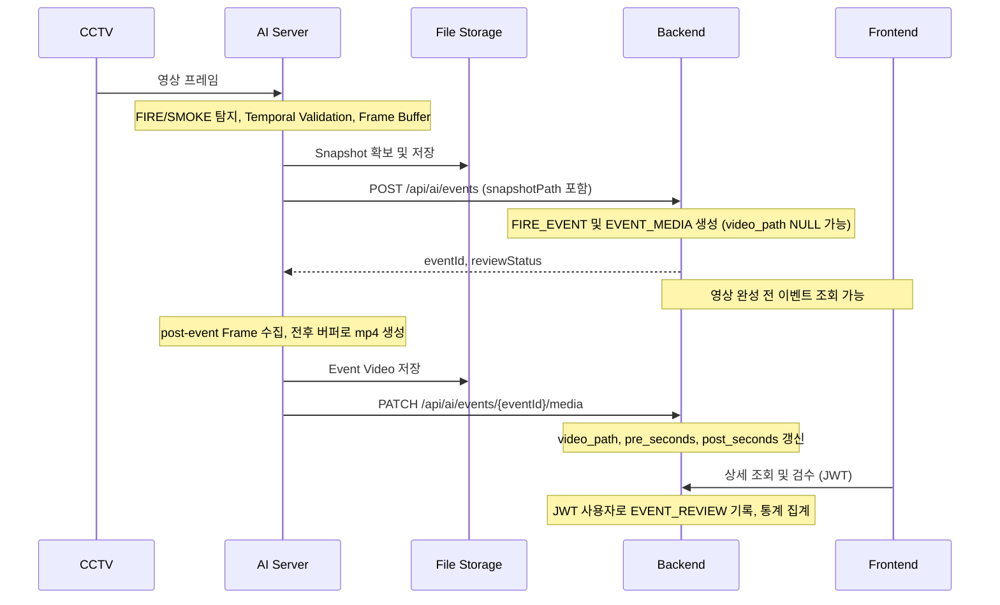

# FIRIS 아키텍처

기준: [PROJECT_CONTEXT](PROJECT_CONTEXT.md). 팀 합의 → 문서 변경 → 코드 변경을 따른다.

## 문서 상태 구분

- **현재 실행 상태**: health check와 네 페이지 placeholder만 구현되어 있다. 연동 완료를 의미하지 않는다.
- **최종 합의**: 앞으로 구현할 요구사항이다. 현재 구현 여부와 구분한다.
- **예시**: JSON의 비밀번호·ID·파일명, 탐지 수치 등 설명용 값이다. 실제 설정으로 확정하지 않는다.
- **확인 필요**: 담당자와 합의 후 문서에 반영할 사항이다. 임의 구현하지 않는다.
- **DB 현재 상태**: H2는 초기 실행 확인용 임시 DB이다. 최종 DB 선정이 아니다. MySQL은 검토 중이며 채택·버전 확정은 아직 문서에 반영되지 않았다.

## Monorepo 및 개발 환경

루트 .git 하나를 공유하고 ai/backend/frontend/docs를 독립된 폴더로 유지한다. 하위 Git Repository는 만들지 않는다.
WSL Ubuntu의 ~/projects/FIRIS를 권장하며 /mnt/c 아래 개발은 가급적 피한다.
VS Code는 WSL: Ubuntu 연결을 권장한다. Frontend 담당자는 Windows도 사용할 수 있고 프로젝트는 OS 독립성을 유지한다.
.gitattributes로 LF/CRLF를 정규화한다.

## 구성 및 책임

| 디렉터리 | 책임 |
| --- | --- |
| ai/app/api | 향후 AI API 라우트 |
| ai/app/services | 향후 탐지 지속 확인, 이벤트 전송, 버퍼/미디어 처리 |
| ai/app/models | 향후 모델 로딩/추론 어댑터. Classification에 종속하지 않음 |
| ai/app/utils | 향후 공통 유틸리티 |
| ai/model | Git에서 제외되는 모델 weight |
| ai/storage/events | Git에서 제외되는 이벤트 Snapshot/영상 |
| backend/.../common | health check 및 공통 설정 |
| backend/.../auth | 향후 인증 및 비밀번호 변경 흐름 |
| backend/.../account | 향후 ADMIN/WORKER 계정 관리 |
| backend/.../camera | 향후 고정 CCTV 조회 및 상태 |
| backend/.../event | 향후 위험 이벤트와 미디어 경로 |
| backend/.../review | 향후 이벤트 최종 검수 |
| backend/.../statistics | 향후 관제 집계 |
| frontend/src/api | Axios 클라이언트 및 향후 API 호출 |
| frontend/src/components, layouts | 향후 공통 컴포넌트 및 화면 배치 |
| frontend/src/pages | Login, Dashboard, History, Admin placeholder |
| frontend/src/hooks, utils | 향후 공통 hooks 및 유틸리티 |
| docs | 구현에 앞서 확인·변경하는 개발 기준 문서 |

## 이벤트 흐름

Frontend 실시간 전송 프로토콜은 아직 정하지 않았다. 위 다이어그램은 특정 push/stream 방식을 확정하지 않는다.
Snapshot 파일명 예시 event_31.jpg는 계약상 eventId 기반 선행 파일 생성을 요구하는 것이 아니다.
실제 파일명 생성과 eventId 매핑 방식은 구현 전에 확인한다.
Backend는 미디어 Binary를 DB에 저장하지 않으며 영상 완성을 기다리지 않는다.

## 모델 및 버퍼

MobileNet Family는 확정이고 Detection Head는 미정이다. AI 담당자가 결정하기 전 일반 Classification에 종속하지 않는다.
PyTorch/TensorFlow 선택과 모델 인터페이스 구현은 담당 기능 개발 시 진행한다.
Temporal Validation의 3초/70%, 버퍼 전후 5초는 실험·조정 가능한 예시이다.
Buffer와 Snapshot/Video 생성 책임은 AI에 있다.

## 인증 및 도메인 경계

사용자 인증은 Authorization: Bearer {accessToken} JWT, 비밀번호는 BCrypt hash를 사용한다.
AI 인증은 X-AI-API-KEY 방식이 후보이며 세부 검증 규칙은 구현 전에 확정한다.
ACCOUNT/CAMERA/FIRE_EVENT/EVENT_MEDIA/EVENT_REVIEW 다섯 테이블을 사용한다.
Statistics Table 없이 집계하며, 검수 행이 없으면 UNREVIEWED이다.
현재 단계에서는 인증·도메인 로직과 Entity를 구현하지 않는다.

## 현재 실행 구성
- AI: FastAPI/Uvicorn, 8000 포트. OpenCV 의존성만 준비하고 모델 추론은 없다.
- Backend: Java 17, Spring Boot, Gradle Wrapper, 8080 포트.
- Spring Web/JPA/Security/Validation과 초기 실행 확인용 임시 메모리 H2를 포함한다. 최종 DB는 별도로 확정한다.
- `ddl-auto: none`, SQL 초기화 비활성화. Entity, 테이블, 계정 시드는 없다.
- Spring Security는 GET /api/health만 허용하고 나머지는 차단한다. 기본 사용자 자동 생성과 폼/Basic 로그인은 사용하지 않는다. JWT는 최종 구현 예정이며 현재 단계에서는 미구현이다.
- Frontend: React/Vite/JavaScript, React Router, Axios, Yarn, 5173 포트. API 연동과 CORS 정책은 아직 구현하지 않는다.
- `docker-compose.yml`은 `services: {}` 예약 파일이며 배포 구성은 없다.

## 환경 및 저장소 원칙
실제 `.env`와 모델 weight, 이벤트 데이터는 커밋하지 않는다. `.env.example`과 `.gitkeep`은 커밋한다.
Backend는 backend 작업 디렉터리의 `.env`를 Spring properties 형식으로 선택적으로 읽는다.
Frontend는 Vite의 `.env` 로딩을 사용한다. `VITE_` 값은 브라우저에 공개되므로 비밀 값을 넣지 않는다.
AI 환경변수는 향후 통합용 예약 항목으로 현재 health check에서는 사용하지 않는다.
루트 `.env.example`은 전체 항목 안내이며 세 파트가 자동으로 공유하지 않는다.

## Frontend 및 패키지 관리

React + Vite + Yarn 4를 유지한다. yarn.lock과 .yarnrc.yml을 커밋한다.
권한 없이 실행하려면 frontend에서 corepack yarn install --immutable / corepack yarn start를 사용한다.
페이지와 화면 컴포넌트는 .jsx, 일반 로직/설정은 .js, 스타일은 .css이다.
페이지는 /login, /dashboard, /history, /admin 네 개이고 이벤트 상세는 Drawer/Modal이다.
Dashboard는 전체 세로 스크롤 없이 CCTV를 항상 노출하는 통합 관제 화면이다.

## Git 협업 및 CI/CD

main은 안정 버전, dev는 통합, feature/*는 기능 개발 브랜치이다.
dev 최신화 → feature 생성 → 담당 기능 개발 → commit/push → PR → dev 병합을 따른다.
main/dev 직접 기능 개발은 피한다. 팀원 Write 권한 및 main/dev 보호 규칙을 사용할 수 있으며 feature/* 생성은 막지 않는다.
CI/CD 담당은 신종건이며 Docker/Compose/Jenkins/GitHub로 Build/Test/Deploy를 자동화할 예정이다.
현재 Dockerfile/Jenkins Pipeline은 만들지 않고 docker-compose.yml은 예약 파일로 둔다.
전체 담당 분담과 담당 API는 PROJECT_CONTEXT 5절을 따른다.

## 구현 전에 확인할 미정 사항

- 실제 운영 DB 종류 및 마이그레이션 도구 (현재 Skeleton은 H2)
- 모델 상세/추론 인터페이스, Confidence/지속 시간 임계값, 버퍼 길이
- 스트리밍/Overlay/신규 이벤트 전달, 파일 저장소 공유 및 브라우저 미디어 접근
- 이벤트 중복 방지, 재시도, 영상 생성 실패 처리, 파일명 및 eventId 매핑
- JWT 수명/저장/갱신, 비밀번호 변경 전 접근 제한, 비활성화·초기화 이후 기존 토큰 처리

미정 사항을 임의로 구현하거나 기존 계약을 바꾸지 않는다. 관련 담당자 및 사용자 확인 후 문서를 먼저 수정한다.
