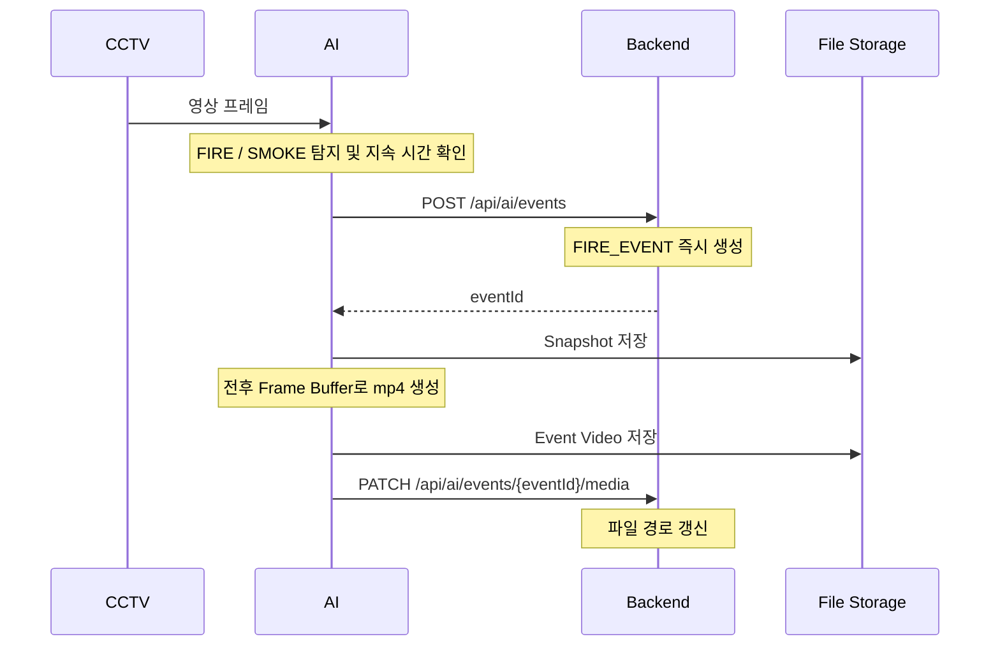

# FIRIS 아키텍처

## 구성 및 책임
한 Repository 안의 독립 프로젝트 세 개로 구성한다. 각자 의존성, 실행 명령, 환경 설정을 가진다.

| 디렉터리 | 책임 |
| --- | --- |
| ai/app/api | 향후 AI API 라우트 |
| ai/app/services | 향후 탐지 지속 확인, 이벤트 전송, 버퍼/미디어 처리 |
| ai/app/models | 향후 모델 로딩/추론 어댑터. Classification에 종속하지 않음 |
| ai/app/utils | 향후 공통 유틸리티 |
| ai/model | Git에서 제외되는 모델 weight |
| ai/storage/events | Git에서 제외되는 이벤트 Snapshot/영상 |
| backend/.../common | health check 및 공통 설정 |
| backend/.../auth | 향후 인증 및 비밀번호 변경 흐름 |
| backend/.../account | 향후 ADMIN/WORKER 계정 관리 |
| backend/.../camera | 향후 고정 CCTV 조회 및 상태 |
| backend/.../event | 향후 위험 이벤트와 미디어 경로 |
| backend/.../review | 향후 이벤트 최종 검수 |
| backend/.../statistics | 향후 관제 집계 |
| frontend/src/api | Axios 클라이언트 및 향후 API 호출 |
| frontend/src/components, layouts | 향후 공통 컴포넌트 및 화면 배치 |
| frontend/src/pages | Login, Dashboard, History, Admin placeholder |
| frontend/src/hooks, utils | 향후 공통 hooks 및 유틸리티 |
| docs | 구현에 앞서 확인·변경하는 개발 기준 문서 |

## 향후 데이터 흐름

Snapshot 경로를 처음 전달하는 시점과 실패 재시도/중복 방지 방식은 API 구현 전에 확정한다.
Frontend는 향후 Backend에서 이벤트·계정·검수 정보를 조회한다.
CCTV 스트리밍 및 Overlay 전송 방식, 실시간 갱신 프로토콜, 공유 저장소/미디어 제공 방식은 미정이다.
로컬 파일 경로가 곧 브라우저 URL인 것은 아니며, 미디어 접근 정책은 향후 결정한다.

## 현재 실행 구성
- AI: FastAPI/Uvicorn, 8000 포트. OpenCV 의존성만 준비하고 모델 추론은 없다.
- Backend: Java 17, Spring Boot, Gradle Wrapper, 8080 포트.
- Spring Web/JPA/Security/Validation과 개발용 메모리 H2를 포함한다.
- `ddl-auto: none`, SQL 초기화 비활성화. Entity, 테이블, 계정 시드는 없다.
- Spring Security는 GET /api/health만 허용하고 나머지는 차단한다. 기본 사용자 자동 생성과 폼/Basic 로그인은 사용하지 않는다. JWT는 구현하지 않는다.
- Frontend: React/Vite/JavaScript, React Router, Axios, Yarn, 5173 포트. API 연동과 CORS 정책은 아직 구현하지 않는다.
- `docker-compose.yml`은 `services: {}` 예약 파일이며 배포 구성은 없다.

## 환경 및 저장소 원칙
실제 `.env`와 모델 weight, 이벤트 데이터는 커밋하지 않는다. `.env.example`과 `.gitkeep`은 커밋한다.
Backend는 backend 작업 디렉터리의 `.env`를 Spring properties 형식으로 선택적으로 읽는다.
Frontend는 Vite의 `.env` 로딩을 사용한다. `VITE_` 값은 브라우저에 공개되므로 비밀 값을 넣지 않는다.
AI 환경변수는 향후 통합용 예약 항목으로 현재 health check에서는 사용하지 않는다.
루트 `.env.example`은 전체 항목 안내이며 세 파트가 자동으로 공유하지 않는다.

## 변경 원칙
기능 구현 전에 네 설계 문서를 확인한다. 설계 변경을 문서에 먼저 반영하고 이후 코드로 구현한다.

## Frontend 파일 및 패키지 관리
Yarn으로 의존성을 관리하며 yarn.lock을 커밋한다. Vite는 개발 서버와 빌드 도구로 유지한다.
페이지는 Dashboard/History/Admin/Login 폴더에 같은 이름의 .js 및 .css 파일로 둔다.
현재 .js placeholder는 JSX 변환 설정 없이 실행되도록 React.createElement를 사용한다.
