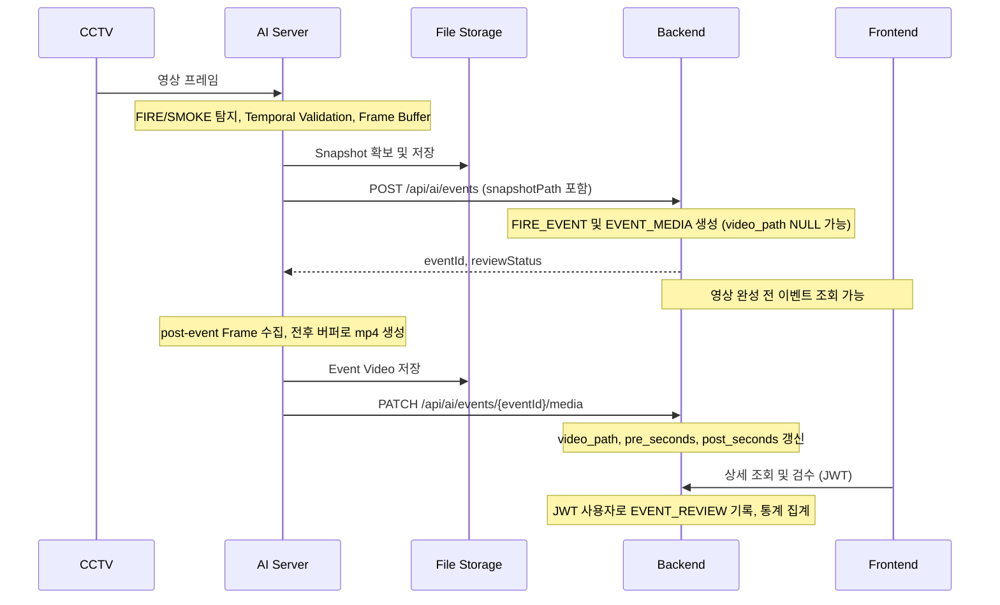

# FIRIS 아키텍처

> 현재 Backend 구현 범위: health check, AI 이벤트 생성·미디어 갱신 및 CAMERA/FIRE_EVENT/EVENT_MEDIA 매핑. [구현·검증 안내](AI_EVENT_IMPLEMENTATION.md)를 함께 확인한다. 금빈님 계정/JWT 및 MySQL 설정이 dev에 병합되어 이 브랜치에도 포함된다.

기준: [PROJECT_CONTEXT](PROJECT_CONTEXT.md). 팀 합의 → 문서 변경 → 코드 변경을 따른다.

## 문서 상태 구분

- **현재 실행 상태**: AI 이벤트 생성·미디어 갱신과 최신 박스 JPEG 조회, Backend 이벤트 이력·상세·검수·미디어 조회 API가 있다. Frontend와 이벤트 API의 연결은 디자인 작업 이후 진행한다. 실제 RTSP는 아직 검증하지 않았다.
- **최종 합의**: 앞으로 구현할 요구사항이다. 현재 구현 여부와 구분한다.
- **예시**: JSON의 비밀번호·ID·파일명, 탐지 수치 등 설명용 값이다. 실제 설정으로 확정하지 않는다.
- **확인 필요**: 담당자와 합의 후 문서에 반영할 사항이다. 임의 구현하지 않는다.
- **DB 현재 상태**: backend 기본 연결은 MySQL이다. 이벤트 API DB 통합 테스트는 별도 MySQL 테스트 DB에서 선택적으로 실행한다. MySQL 버전은 8.4.11로 확정했으며, 운영 스키마 관리 정책은 별도 확인이 필요하다.

## Monorepo 및 개발 환경

루트 .git 하나를 공유하고 ai/backend/frontend/docs를 독립된 폴더로 유지한다. 하위 Git Repository는 만들지 않는다.
WSL Ubuntu의 ~/projects/FIRIS를 권장하며 /mnt/c 아래 개발은 가급적 피한다.
VS Code는 WSL: Ubuntu 연결을 권장한다. Frontend 담당자는 Windows도 사용할 수 있고 프로젝트는 OS 독립성을 유지한다.
.gitattributes로 LF/CRLF를 정규화한다.

## 구성 및 책임

| 디렉터리 | 책임 |
| --- | --- |
| ai/app/api | 향후 AI API 라우트 |
| ai/app/services | 향후 탐지 지속 확인, 이벤트 전송, 버퍼/미디어 처리 |
| ai/app/models | 향후 모델 로딩/추론 어댑터. Classification에 종속하지 않음 |
| ai/app/utils | 향후 공통 유틸리티 |
| ai/model | Git에서 제외되는 모델 weight |
| storage/events | Git에서 제외되는 이벤트 Snapshot/영상 |
| backend/.../common | health check 및 공통 설정 |
| backend/.../auth | 향후 인증 및 비밀번호 변경 흐름 |
| backend/.../account | 향후 ADMIN/WORKER 계정 관리 |
| backend/.../camera | 향후 고정 CCTV 조회 및 상태 |
| backend/.../event | 향후 위험 이벤트와 미디어 경로 |
| backend/.../review | 향후 이벤트 최종 검수 |
| backend/.../statistics | 향후 관제 집계 |
| frontend/src/api | Axios 클라이언트 및 향후 API 호출 |
| frontend/src/components, layouts | 향후 공통 컴포넌트 및 화면 배치 |
| frontend/src/pages | Login, Dashboard, History, Admin placeholder |
| frontend/src/hooks, utils | 향후 공통 hooks 및 유틸리티 |
| docs | 구현에 앞서 확인·변경하는 개발 기준 문서 |

## 이벤트 흐름

Dashboard의 현재 박스 영상 전달은 AI 영상 처리기 → 카메라별 최신 박스 JPEG → AI 인증 API → Backend JWT 프록시 → 프론트 주기적 조회 방식이다. `GET /api/cameras/{cameraId}/frame`을 프론트에서 Blob으로 받아 표시한다. 서버 푸시 방식으로 변경할지는 실제 CCTV 지연·부하 검증 후 결정한다. 이벤트 Snapshot/MP4는 원본을 보관하며 최신 프레임 API와 구분한다.
Snapshot 파일명 예시 event_31.jpg는 계약상 eventId 기반 선행 파일 생성을 요구하는 것이 아니다.
실제 파일명 생성과 eventId 매핑 방식은 구현 전에 확인한다.
Backend는 미디어 Binary를 DB에 저장하지 않으며 영상 완성을 기다리지 않는다.

## 모델 및 버퍼

MobileNet Family는 확정이고 Detection Head는 미정이다. AI 담당자가 결정하기 전 일반 Classification에 종속하지 않는다.
PyTorch/TensorFlow 선택과 모델 인터페이스 구현은 담당 기능 개발 시 진행한다.
Temporal Validation의 3초/70%, 버퍼 전후 5초는 실험·조정 가능한 예시이다.
Buffer와 Snapshot/Video 생성 책임은 AI에 있다.

AI 영상 처리의 현재 연동 시작값은 초당 5회 추론, 최근 2초의 10회 중 7회 이상 탐지이다. 추론이 조금 느려지면 실제 수집된 결과의 70%를 적용하되 최소 6개가 필요하다. 이는 2026-10-01 발표자료의 추가 탐지 지연 3초 이내 목표를 시험하기 위한 값이며 최종 임계값이 아니다. FIRE/SMOKE는 따로 집계하고 Bounding Box가 있으면 같은 영역의 탐지로 묶는다. 확정 후 같은 위험이 지속되는 동안 중복 이벤트를 만들지 않는다. 영상 버퍼는 추론 샘플과 별도로 JPEG 압축 프레임을 보관한다. AI는 스냅샷 저장 직후 Backend에서 eventId를 받고 메타데이터에 기록한 다음, 이후 프레임을 수집해 영상을 저장하고 해당 eventId로 미디어를 갱신한다. 실제 CCTV 영상에서 지연·오탐/시간·누락률을 측정해 임계값을 조정한다.

## 인증 및 도메인 경계

사용자 인증은 Authorization: Bearer {accessToken} JWT, 비밀번호는 BCrypt hash를 사용한다.
이번 이벤트 API는 X-AI-API-KEY를 AI_API_KEY와 비교한다. 미설정·누락·불일치는 401로 차단한다.
ACCOUNT/CAMERA/FIRE_EVENT/EVENT_MEDIA/EVENT_REVIEW 다섯 테이블을 사용한다.
Statistics Table 없이 집계하며, 검수 행이 없으면 UNREVIEWED이다.
AI API Key 인증과 이벤트 저장·미디어 갱신 및 세 Entity는 구현했다. 사용자 JWT와 다른 도메인은 이번 범위 밖이다.

## 현재 실행 구성
- AI: FastAPI/Uvicorn, 8000 포트. 모델 추론과 영상 시간 창 판정·Backend 호출, 박스 JPEG 발행 코드가 있다. 로컬 AVI에서 YOLO 추론과 Backend/MySQL 이벤트 저장을 확인했다. 실제 CCTV RTSP 검증은 아직 없다.
- Backend: Java 17, Spring Boot, Gradle Wrapper, 8080 포트.
- Spring Web/JPA/Security/Validation과 MySQL 런타임 드라이버를 포함한다. 이벤트 API DB 통합 테스트는 별도 MySQL 테스트 DB에서 선택적으로 실행한다.
- `ddl-auto`는 dev 기본값 update이며 SQL 초기화는 비활성화되어 있다. ACCOUNT, CAMERA 및 FIRE_EVENT/EVENT_MEDIA/EVENT_REVIEW Entity가 있고 관리자 계정은 최초 시작 시 생성된다. CAMERA 시드는 아직 없다. MySQL 통합 테스트만 전용 firis_test DB에서 create-drop을 사용한다.
- 공통 Spring Security 설정에는 사용자 JWT·역할 권한이 있다. 별도 우선순위 체인이 /api/ai/**의 API Key를 검증한다. GET /api/health는 공개된다.
- Frontend: React/Vite/JavaScript, React Router, Axios, Yarn, 5173 포트. 현재 이벤트 API 연동 전이며 디자인 완료 후 연결한다. Backend CORS는 localhost:5173을 허용한다.
- `docker-compose.yml`은 MySQL 8.4.11, Backend, AI, Frontend 서비스의 로컬 통합 실행 구성을 제공한다.

## 환경 및 저장소 원칙
실제 `.env`와 모델 weight, 이벤트 데이터는 커밋하지 않는다. `.env.example`과 `.gitkeep`은 커밋한다.
Backend는 backend 작업 디렉터리의 `.env`를 Spring properties 형식으로 선택적으로 읽는다.
Frontend는 Vite의 `.env` 로딩을 사용한다. `VITE_` 값은 브라우저에 공개되므로 비밀 값을 넣지 않는다.
AI는 `.env`에서 BACKEND_URL/AI_API_KEY, AI_MODELS_DIR/EVENT_STORAGE_DIR을 읽는다. health check는 모델 경로의 파일 존재와 Git LFS 포인터 여부만 확인한다.
루트 `.env.example`은 전체 항목 안내이며 세 파트가 자동으로 공유하지 않는다.

## Frontend 및 패키지 관리

React + Vite + Yarn 4를 유지한다. yarn.lock과 .yarnrc.yml을 커밋한다.
권한 없이 실행하려면 frontend에서 corepack yarn install --immutable / corepack yarn start를 사용한다.
페이지와 화면 컴포넌트는 .jsx, 일반 로직/설정은 .js, 스타일은 .css이다.
페이지는 /login, /dashboard, /history, /admin 네 개이고 이벤트 상세는 Drawer/Modal이다.
Dashboard는 전체 세로 스크롤 없이 CCTV를 항상 노출하는 통합 관제 화면이다.

## Git 협업 및 CI/CD

main은 안정 버전, dev는 통합, feature/*는 기능 개발 브랜치이다.
dev 최신화 → feature 생성 → 담당 기능 개발 → commit/push → PR → dev 병합을 따른다.
main/dev 직접 기능 개발은 피한다. 팀원 Write 권한 및 main/dev 보호 규칙을 사용할 수 있으며 feature/* 생성은 막지 않는다.
CI/CD 담당은 신종건이며 Docker/Compose/Jenkins/GitHub로 Build/Test/Deploy를 자동화할 예정이다.
AI/Backend/Frontend Dockerfile과 Jenkins Pipeline이 있으며, docker-compose.yml에는 MySQL 8.4.11, Backend, AI, Frontend 서비스 구성이 있다. Jenkins는 AI/Backend/Frontend Docker 이미지를 빌드하고 검증한다.
전체 담당 분담과 담당 API는 PROJECT_CONTEXT 5절을 따른다.

## 구현 전에 확인할 미정 사항

- 실제 운영 DB 종류 및 마이그레이션 도구 (현재 기본 연결은 MySQL)
- 모델 상세/추론 인터페이스, Confidence/지속 시간 임계값, 버퍼 길이
- 스트리밍/Overlay/신규 이벤트 전달, 파일 저장소 공유 및 브라우저 미디어 접근
- 이벤트 중복 방지, 재시도, 영상 생성 실패 처리, 파일명 및 eventId 매핑
- JWT 저장/갱신, 비활성화·초기화 이후 기존 토큰 처리

미정 사항을 임의로 구현하거나 기존 계약을 바꾸지 않는다. 관련 담당자 및 사용자 확인 후 문서를 먼저 수정한다.
